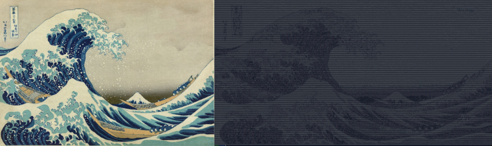

<h1 align = "center"> Pixel Player </h1>


<p align="center">
  
</p>

<p align = "center">
Use C to print any .jpg or .png image into your terminal as ASCII art!
</p>

## Table of Contents  
[What does this code do?](#what-does-this-code-do)  
[Structure Overview](#structure-overview) 

## What does this code do?

This code takes a string representing the file path to either a .jpg or .png image, loads it as a character array as long as the pixel width*height, and then converts it to an array of arrays, which represents the grayscaled image. At this point, the array is looped through and the grayscale values are replaced with their corresponding ASCII art, depending on how dark or light the image needs to be. Note that this code will load only the grayscale values of an image so it does not matter how many layers the image has. 


## Structure Overview

Pixel Player takes an image from your computer (file path specified by you) and prints it out as ASCII art. The image is turned into grayscale, and then the dithered image is turned into ASCII art by assigning each gray tone to a different character. Then the ASCII art is printed onto the terminal. 


This program only loads jpgs and pngs. If you try to load any other image type, the program will crash.

## How to run the code


### Cloning the Repository
First, clone this directory onto your computer. To do this, click the green "code" button at the top of the screen. From there, either copy the SSH link or the HTTPS link. Then, in your terminal, run 
  ```
  git clone [copy link here].
  ```
  Once the repository is fully loaded up. Run the following lines of code in your terminal.
  ```
  mkdir build
  cd build/
  cmake ..
  make
  ./src/main
  ```
  The program will ask you for the file path of the image. Enter it. All preloaded images are stored in the /src/img folder. To find the file path run the following line in of the folder of image:
  ```
  readlink -f name_of_file.filetype
  ```
  
## Dependencies

## Demos


