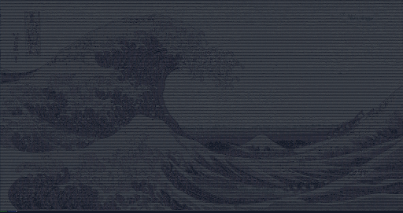

<h1 align = "center"> Pixel Player </h1>

  
   

Description

Load in an image and prints it out as ASCII art. Performs dithering on the image
before printing. Takes in jpgs and pngs. Provide a file path to load in an
image.

How to run code

Dependencies

Demos
